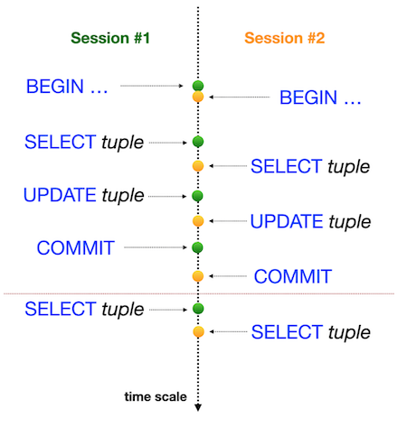

# Day 08

## Изоляция — одно из свойств ACID

Работа с транзакциями и уровнями изоляции в базе данных.

## Introduction

- Для написания программ использовалась версия 15.2 PostgreSQL.
- Исходный код писался в DataGrip IDE.

## Contents

1. [Exercise 00](#exercise-00)
2. [Exercise 01](#exercise-01)
3. [Exercise 02](#exercise-02)
4. [Exercise 03](#exercise-03)
5. [Exercise 04](#exercise-04)
6. [Exercise 05](#exercise-05)
7. [Exercise 06](#exercise-06)
8. [Exercise 07](#exercise-07)

## Rules of the day

- Убедитесь, что у вас есть собственная база данных и доступ к ней PostgreSQL.
- Загрузите [скрипт](materials/model.sql) с моделью базы данных здесь и примените его к своей базе данных. **Все изменения, которые были внесены в День 03 в упражнениях 07–13 и День 04 в упражнении 07, должны быть на месте (это похоже на то, как в реальном мире, когда применяется выпуск, и необходимо обеспечить согласованность с данными для новых изменений).**
- Для этого дня используется командная строка для базы данных PostgreSQL (psql). Для проверки, как изменения будут опубликованы в базе данных для других пользователей базы данных.
- Логическое представление предоставленной модели базы данных:

1. **pizzeria** (Таблица с доступными пиццериями)
- поле id - первичный ключ
- поле name - название пиццерий
- поле rating - средний рейтинг пиццерии (от 0 до 5 баллов)
2. **person** (Таблица с людьми, которые любят пиццу)
- поле id - первичный ключ
- поле name - имя человека
- поле age - возраст человека
- поле gender - половая принадлежность человека
- поле address - адрес человека
3. **menu** (Таблица с доступным меню и ценой на конкретную пиццу)
- поле id - первичный ключ
- поле pizzeria_id - внешний ключ от таблицы пиццерий
- поле pizza_name - название пиццы в пиццерии
- поле price - цена конкретной пиццы
4. **person_visits** (Таблица с информацией о посещениях пиццерии)
- поле id - первичный ключ
- поле person_id - внешний ключ от таблицы с людьми
- поле pizzeria_id - внешний ключ от таблицы пиццерий
- поле visit_date - дата (например: 01.01.2022) посещения человека
5. **person_order** (Таблица с информацией о заказах людей)
- поле id - первичный ключ
- поле person_id - внешний ключ от таблицы с людьми
- поле menu_id - внешний ключ от таблицы с меню
- поле order_date - дата (например: 01.01.2022) заказа человека

Посещение человека и заказ человека являются разными сущностями и не содержат никакой корреляции между данными. Например, клиент может находиться в одном ресторане (просто просматривая меню), а в это время сделать заказ в другом по телефону или через мобильное приложение. Или другой случай, просто оказаться дома и снова позвонить с заказом без всяких посещений.

## Exercise 00

- Программа расположена в директории: ex00;
- Файл для сдачи: `day08_ex00.sql` с комментариями к заявлениям Сессии №1, Сессии №2, снимок экрана с выводом psql для сеанса №1, снимок экрана вывода psql для сеанса № 2;
- Языки: SQL.

Для этой задачи была использована командная строка для базы данных PostgreSQL (psql). Были проведены проверки, как изменения будут опубликованы в базе данных для других пользователей базы данных.

Для этого были использованы две активные сессии (имеются в виду 2 параллельные сессии в командных строках).

Предоставлены доказательства того, что параллельный сеанс не сможет увидеть изменения, пока не будет сделан `COMMIT`;

Взгляните на шаги ниже.

**Session #1**
- Обновили рейтинг «Pizza Hut» до 5 баллов в режиме транзакции.
- Убедились, что изменения в сеансе №1 видны.

**Session #2**
- Убедились, что изменения не видны в сеансе №2.

**Session #1**
- Опубликовали изменения для всех параллельных сеансов.

**Session #2**
- Убедились, что изменения видны в сеансе №2.

Итак, образец для сеанса №2 представлен ниже.

    pizza_db=> select * from pizzeria where name  = 'Pizza Hut';
    id |   name    | rating
    ----+-----------+--------
    1 | Pizza Hut |    4.6
    (1 row)

    pizza_db=> select * from pizzeria where name  = 'Pizza Hut';
    id |   name    | rating
    ----+-----------+--------
    1 | Pizza Hut |      5
    (1 row)

Вы можете видеть, что один и тот же запрос возвращает разные результаты, поскольку первый был запущен перед публикацией в сеансе № 1, а второй был запрошен после завершения сеанса № 1.

## Exercise 01

- Программа расположена в директории: ex01;
- Файл для сдачи: `day08_ex01.sql` с комментариями к заявлениям Сессии №1, Сессии №2, снимок экрана с выводом psql для сеанса №1, снимок экрана вывода psql для сеанса № 2;
- Языки: SQL.

Для этой задачи была использована командная строка для базы данных PostgreSQL (psql). Были проведены проверки, как изменения будут опубликованы в базе данных для других пользователей базы данных.

Для этого были использованы две активные сессии (имеются в виду 2 параллельные сессии в командных строках).

Перед выполнением задачи убедились, что в базе данных установлен уровень изоляции по умолчанию.Для этого необходимо запустить следующий оператор:

`SHOW TRANSACTION ISOLATION LEVEL;`

и результат должен быть “read committed”;

Если нет, то необходимо установить уровень изоляции “read committed” явно на уровне сеанса.

| Проверили один из известных шаблонов базы данных «Аномалия потерянного обновления». Графическое представление этой аномалии на картинке. Горизонтальная красная линия означает окончательные результаты после всех последовательных шагов для обеих сессий. |  |
| ------ | ------ |

Была проведена проверка рейтинга «Pizza Hut» в режиме транзакции для обоих сеансов, после этого выполнен `UPDATE` рейтинга до значения 4 в сеансе № 1 и выполнен `UPDATE` рейтинга до значения 3,6 в сеансе № 2.

## Exercise 02

- Программа расположена в директории: ex02;
- Файл для сдачи: `day08_ex02.sql` с комментариями к заявлениям Сессии №1, Сессии №2, снимок экрана с выводом psql для сеанса №1, снимок экрана вывода psql для сеанса № 2;
- Языки: SQL.

Для этой задачи была использована командная строка для базы данных PostgreSQL (psql). Были проведены проверки, как изменения будут опубликованы в базе данных для других пользователей базы данных.

Для этого были использованы две активные сессии (имеются в виду 2 параллельные сессии в командных строках).

| Проверили проверку одного из известных шаблонов базы данных «Потерянное обновление», но с уровнем изоляции `REPEATABLE READ`. Графическое представление этой аномалии можно увидеть на картинке. Горизонтальная красная линия означает окончательные результаты после всех последовательных шагов для обеих сессий.|  |
| ------ | ------ |

Проверили рейтинг «Pizza Hut» в режиме транзакции для обоих сеансов, после этого выполнили `UPDATE` рейтинга до значения 4 в сеансе № 1 и выполнили `UPDATE` рейтинга до значения 3,6 в сеансе № 2 (в том же порядке как представлено на картинке).

## Exercise 03

- Программа расположена в директории: ex03;
- Файл для сдачи: `day08_ex03.sql` с комментариями к заявлениям Сессии №1, Сессии №2, снимок экрана с выводом psql для сеанса №1, снимок экрана вывода psql для сеанса № 2;
- Языки: SQL.

Для этой задачи была использована командная строка для базы данных PostgreSQL (psql). Были проведены проверки, как изменения будут опубликованы в базе данных для других пользователей базы данных.

Для этого были использованы две активные сессии (имеются в виду 2 параллельные сессии в командных строках).

| Провели проверку одного из известных шаблонов базы данных «Неповторяемое чтение», но с уровнем изоляции `READ COMMITTED`. Графическое представление этой аномалии можно увидеть на картинке. Горизонтальная красная линия означает окончательные результаты после всех последовательных шагов для обеих сессий.|  |
| ------ | ------ |

Проверили рейтинг «Pizza Hut» в режиме транзакции для обоих сеансов, а затем выполнили `UPDATE` рейтинга до значения 3,6 в сеансе № 2 (в том же порядке, что и на рисунке).

## Exercise 04

- Программа расположена в директории: ex04;
- Файл для сдачи: `day08_ex04.sql` с комментариями к заявлениям Сессии №1, Сессии №2, снимок экрана с выводом psql для сеанса №1, снимок экрана вывода psql для сеанса № 2;
- Языки: SQL.

Для этой задачи была использована командная строка для базы данных PostgreSQL (psql). Были проведены проверки, как изменения будут опубликованы в базе данных для других пользователей базы данных.

Для этого были использованы две активные сессии (имеются в виду 2 параллельные сессии в командных строках).

| Проверили проверку одного из известных шаблонов базы данных «Неповторяемое чтение», но с уровнем изоляции `SERIALIZABLE`. Графическое представление этой аномалии можно увидеть на картинке. Горизонтальная красная линия означает окончательные результаты после всех последовательных шагов для обеих сессий.|  |
| ------ | ------ |

Проверили рейтинг «Pizza Hut» в режиме транзакции для обоих сеансов, а затем выполнили `UPDATE` рейтинга до значения 3,0 в сеансе № 2 (в том же порядке, что и на рисунке).

## Exercise 05

- Программа расположена в директории: ex05;
- Файл для сдачи: `day08_ex05.sql` с комментариями к заявлениям Сессии №1, Сессии №2, снимок экрана с выводом psql для сеанса №1, снимок экрана вывода psql для сеанса № 2;
- Языки: SQL.

Для этой задачи была использована командная строка для базы данных PostgreSQL (psql). Были проведены проверки, как изменения будут опубликованы в базе данных для других пользователей базы данных.

Для этого были использованы две активные сессии (имеются в виду 2 параллельные сессии в командных строках).

| Проверили проверку одного из известных шаблонов базы данных «Фантомное чтение», но с уровнем изоляции `READ COMMITTED`. Графическое представление этой аномалии можно увидеть на картинке. Горизонтальная красная линия означает окончательные результаты после всех последовательных шагов для обеих сессий.|  |
| ------ | ------ |

Просуммировали все рейтинги для всех пиццерий в режиме транзакций для обеих сессий и после этого сделали `UPDATE` рейтинга до значения 1 для ресторана «Pizza Hut» в сеансе №2 (в том же порядке, что и на рисунке).

## Exercise 06

- Программа расположена в директории: ex06;
- Файл для сдачи: `day08_ex06.sql` с комментариями к заявлениям Сессии №1, Сессии №2, снимок экрана с выводом psql для сеанса №1, снимок экрана вывода psql для сеанса № 2;
- Языки: SQL.

Для этой задачи была использована командная строка для базы данных PostgreSQL (psql). Были проведены проверки, как изменения будут опубликованы в базе данных для других пользователей базы данных.

Для этого были использованы две активные сессии (имеются в виду 2 параллельные сессии в командных строках).

| Проверили проверку одного из известных шаблонов базы данных «Фантомное чтение», но с уровнем изоляции `REPEATABLE READ`. Графическое представление этой аномалии можно увидеть на картинке. Горизонтальная красная линия означает окончательные результаты после всех последовательных шагов для обеих сессий. |  |
| ------ | ------ |

Просуммировали все рейтинги для всех пиццерий в режиме транзакций для обеих сессий и после этого сделали `UPDATE` рейтинга до значения 5 для ресторана «Pizza Hut» в сеансе №2 (в том же порядке, что и на рисунке).

## Exercise 07

- Программа расположена в директории: ex07;
- Файл для сдачи: `day08_ex07.sql` с комментариями к заявлениям Сессии №1, Сессии №2, снимок экрана с выводом psql для сеанса №1, снимок экрана вывода psql для сеанса № 2;
- Языки: SQL.

Для этой задачи была использована командная строка для базы данных PostgreSQL (psql). Были проведены проверки, как изменения будут опубликованы в базе данных для других пользователей базы данных.

Для этого были использованы две активные сессии (имеются в виду 2 параллельные сессии в командных строках).

Была воспроизведена тупиковая ситуация в базе данных.

| Графическое представление тупиковой ситуации можно увидеть на картинке. Похоже на “christ-lock” между параллельными сеансами. |  |
| ------ | ------ |

Написан оператор SQL с уровнем изоляции по-умолчанию в таблице `pizzeria`, чтобы воспроизвести эту тупиковую ситуацию.
